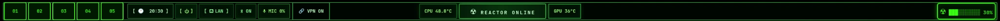

# Custom-Linux-Waybar — Nuclear Reactor Dotfiles

<p align="center">
  
</p>

A complete **CachyOS / Arch Linux + Hyprland nuclear-reactor rice** built around the original Waybar setup.

The repository is organized as a real dotfiles collection: each application owns its configuration under `dotfiles/`, while the installer links everything into `~/.config` without hard-coding the repository location.

The organization is inspired by the component-based layout of [`pewdiepie-archdaemon/dionysus`](https://github.com/pewdiepie-archdaemon/dionysus), while the configuration, scripts, palette, and reactor theme here are its own implementation.

## Features

- ☢️ Nuclear reactor status indicator
- 🌡️ CPU & GPU temperature telemetry
- 01–05 fixed Hyprland workspaces
- 🕒 Clock, network, Bluetooth, microphone, VPN, volume, and brightness
- 🟢 Nuclear-green Waybar styling with warning/critical thermal states
- 🚀 Nuclear Rofi launcher as its own dotfile
- 🖥️ Hyprland, Hyprlock, and Hypridle configuration
- 🐈 Kitty terminal theme
- 📊 Fastfetch system information
- 📈 btop with a matching nuclear theme
- ⏻ wlogout power menu
- 📦 Arch package manifests
- 🔗 Symlink-based installation with automatic backups
- 🔄 Update and uninstall helpers

## Install

```bash
git clone https://github.com/marcottejkevin-art/Custom-Linux-Waybar.git
cd Custom-Linux-Waybar
bash install.sh
```

The installer creates symlinks into `~/.config` and backs up existing files before replacing them. Your original configuration is not deleted by the installer.

After installation, restart Waybar:

```bash
pkill waybar 2>/dev/null || true
waybar >/tmp/waybar.log 2>&1 &
```

For a complete Arch/CachyOS setup, review `packages/pacman.txt` first. Install optional packages from `packages/aur.txt` separately if you want them.

## Recommended packages

```bash
sudo pacman -S --needed - < packages/pacman.txt
```

Optional VPN support:

```bash
sudo pacman -S tailscale
```

## Dotfiles

```text
dotfiles/
├── btop/
│   ├── btop.conf
│   └── themes/
│       └── nuclear.theme
├── fastfetch/
│   └── config.jsonc
├── hypr/
│   ├── hyprland.conf
│   ├── hypridle.conf
│   └── hyprlock.conf
├── kitty/
│   └── kitty.conf
├── rofi/
│   └── nuclear.rasi
├── waybar/
│   ├── config.jsonc
│   ├── style.css
│   ├── tailscale.sh
│   ├── tailscale-toggle.sh
│   └── scripts/
│       ├── cpu-status.sh
│       ├── gpu-status.sh
│       ├── mic.sh
│       ├── reactor.sh
│       ├── temps.sh
│       └── vpn.sh
└── wlogout/
    ├── layout
    └── style.css
```

## Repository layout

```text
Custom-Linux-Waybar/
├── dotfiles/             # Actual application configurations
├── packages/             # Arch package manifests
├── scripts/              # Install / update / uninstall helpers
├── theme/                # Shared visual design documentation
├── screenshots/          # Future showcase assets
├── wallpapers/           # Future wallpaper collection
├── install.sh            # Main installer entry point
├── uninstall.sh          # Main uninstall entry point
├── README.md
└── waybar-preview.webp
```

## Nuclear theme

The visual language is intentionally consistent across the desktop:

- `#39FF14` — radioactive green primary accent
- `#B6FF9C` — readable green foreground
- `#071407` — dark green panels
- `#030A03` — near-black reactor background
- `#FFF27A` — warning state
- `#FF3030` — critical state
- JetBrainsMono Nerd Font — primary typography

See [`theme/palette.md`](theme/palette.md) for the shared palette.

## Waybar layout

The reactor bar is arranged as:

```text
LEFT                                      CENTER                         RIGHT
01 02 03 04 05 | TIME | POWER | WIFI | BT | MIC | VPN | CPU TEMP | ☢ REACTOR ONLINE | GPU TEMP | VOLUME | BRIGHTNESS
```

The center reactor status is intentionally kept between CPU and GPU telemetry so it reads like a compact control-room dashboard.

## Scripts

### Install

```bash
bash install.sh
```

### Update

Pull the latest dotfiles and relink them:

```bash
bash scripts/update.sh
```

### Uninstall

Remove only the symlinks created by this repository:

```bash
bash uninstall.sh
```

Backups created during installation are left untouched.

## Portability

The temperature scripts do not hard-code a particular CPU or GPU. They use `sensors` and `nvidia-smi`, with a sensor fallback for systems without NVIDIA tooling.

The dotfiles are designed for Arch-based Wayland systems, especially CachyOS + Hyprland, but most individual components can be used independently.

## Notes

- The Hyprland config is a clean starting point; adapt monitor and machine-specific rules to your hardware.
- The Rofi configuration lives independently under `dotfiles/rofi/` so it can be installed or edited without touching Waybar.
- The Waybar scripts are intentionally portable and use standard system tools where possible.

## GitHub

Repository name: `Custom-Linux-Waybar`

The repository name is intentionally not hard-coded into the installer, so the dotfiles can be cloned from any fork or renamed repository.
